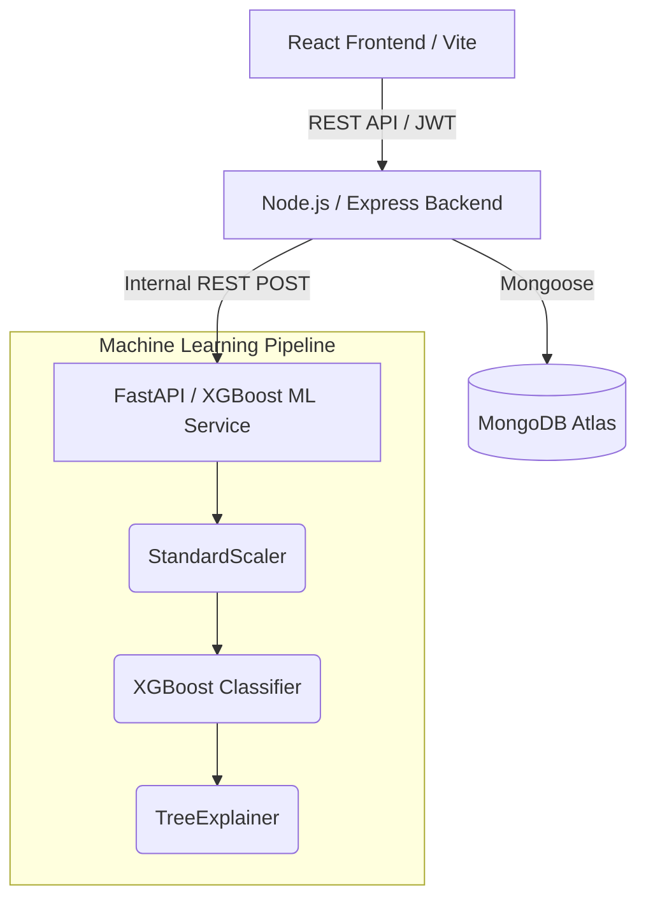
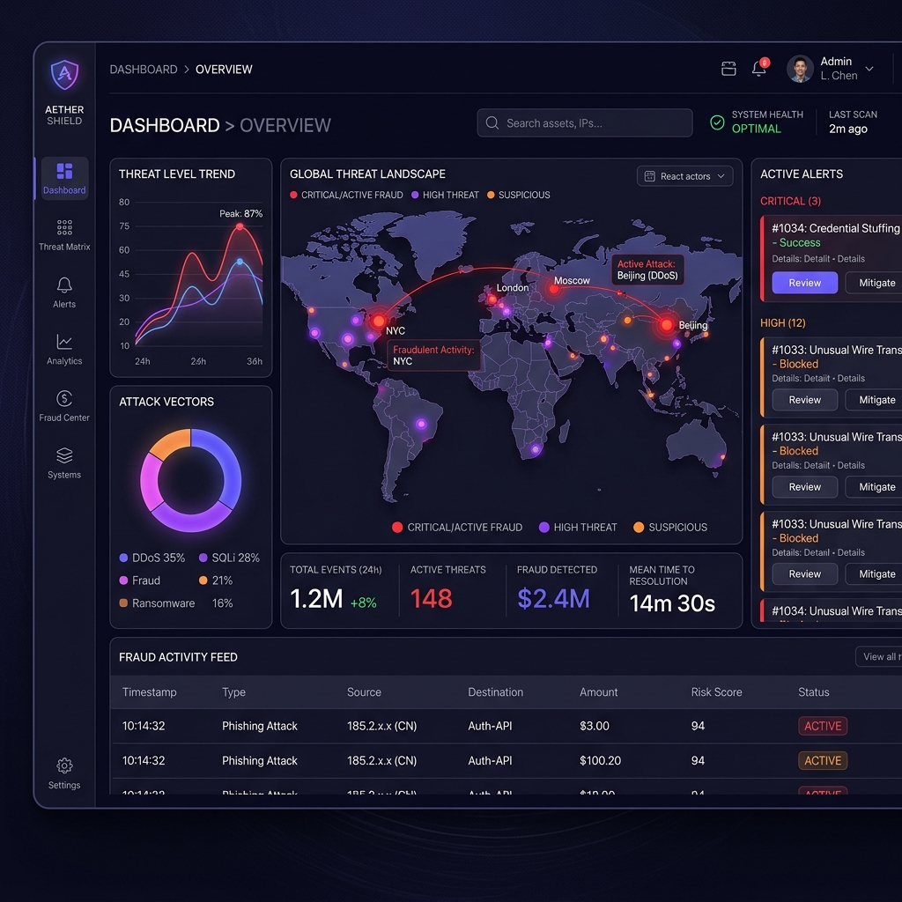

<div align="center">
  
  # 🛡️ FraudShield 2.0
  **Enterprise-Grade AI Credit Card Fraud Detection Platform**

  [](https://vercel.com/new)
  [](https://opensource.org/licenses/MIT)
  [](https://reactjs.org/)
  [](https://nodejs.org/)
  [](https://fastapi.tiangolo.com/)
  
  [View Live Demo](https://fraud-detection-platform-rose.vercel.app) · [Report Bug](https://github.com/prakul-dhiman/fraud-detection-platform/issues) · [Request Feature](https://github.com/prakul-dhiman/fraud-detection-platform/issues)
</div>

---

## 📖 Overview

FraudShield is a CV-worthy, production-ready full-stack application designed to detect credit card fraud in real-time. By leveraging a highly optimized **XGBoost** machine learning model (trained on an imbalanced European dataset using SMOTE) and an ultra-fast **FastAPI** inference engine, FraudShield identifies fraudulent transactions in under 10 milliseconds. 

This project was built from scratch to demonstrate full-stack engineering, microservices architecture, and enterprise-grade UI design (Glassmorphism & dark mode).

## ✨ Key Features

- **🧠 Explainable AI (XAI)**: We don't just predict fraud; we explain *why*. Using **SHAP (SHapley Additive exPlanations)**, every prediction generates a breakdown of which features triggered the alert.
- **⚡ Real-Time & Bulk Processing**: Analyze a single transaction instantly or upload a massive CSV for batch processing.
- **📊 Real-Time Analytics Dashboard**: Built with **Recharts**, the dashboard visualizes historical fraud trends, volume, and SHAP feature importance.
- **🔐 Strict Security**: JWT-based authentication, Bcrypt password hashing, and real OTP phone verification onboarding flow.
- **🎨 Stunning UI/UX**: Custom-built Glassmorphism dark theme using **Tailwind CSS**, featuring interactive mockups and fully responsive layouts.

---

## 🏗️ Architecture



---

## 🛠️ Technology Stack

### Frontend (User Interface)
- **React 18** + **Vite** (for blazing fast HMR & builds)
- **Tailwind CSS v3** (Custom UI tokens, gradients, animations)
- **Recharts** (Complex data visualization)
- **Framer Motion** (Micro-animations)
- **React Router v6** (Client-side routing with Auth Guards)

### Backend (Business Logic & Auth)
- **Node.js** & **Express.js** (REST API)
- **MongoDB** & **Mongoose** (Database)
- **JWT & Bcrypt** (Authentication & Security)
- **Multer** (CSV File handling)

### Machine Learning (Inference Service)
- **Python 3.10+** & **FastAPI** (High-performance microservice)
- **XGBoost** (Gradient boosted decision trees)
- **SHAP** (Model Explainability)
- **Pandas & Scikit-Learn** (Data processing pipeline)

---

## 🚀 Getting Started

### Prerequisites
Make sure you have Node.js (v20+), Python (3.10+), and a MongoDB Atlas URI.

### 1. Backend Setup
```bash
cd backend
npm install
# Rename .env.example to .env and add your MONGODB_URI and JWT_SECRET
npm run dev
```

### 2. ML Service Setup
```bash
cd ml-service
python -m venv venv
# Activate venv: .\venv\Scripts\activate (Windows) or source venv/bin/activate (Mac/Linux)
pip install -r requirements.txt
uvicorn app.main:app --host 0.0.0.0 --port 8000
```

### 3. Frontend Setup
```bash
cd frontend
npm install
npm run dev
```
Visit `http://localhost:3000` to view the application!

---

## 📸 Application Gallery

> **Note:** Please visit the live demo link above to interact with the application yourself!

<div align="center">
  
  <p><i>The central command dashboard showing real-time statistics and feature analysis.</i></p>
</div>

---

<div align="center">
  <p>Built with ❤️ for the love of Data Science and Full-Stack Engineering.</p>
</div>
